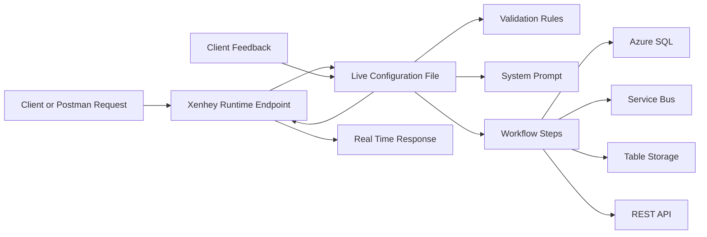

# Xenhey-Live-Configuration-Runtime-Reduce-Context-Switching

Xenhey with Azure Cloud Backend helps teams reduce context switching by allowing API behavior, validation rules, system prompts, workflow steps, and endpoint updates to be controlled through live configuration instead of constant code changes and redeployments. This creates a faster delivery model where teams can test, validate, update, and switch between scenarios in real time using Postman.

The key value is speed and responsiveness. Developers, architects, and client facing teams can make configuration updates during a working session, immediately test the endpoint, and show results back to the client. This makes solution validation feel as simple as editing a document live, while still supporting real API behavior, AI prompt testing, business rule validation, and workflow automation.

Xenhey improves delivery efficiency by reducing deployment overhead, shortening feedback loops, supporting rapid scenario switching, and helping teams validate client requirements in real time. It is especially valuable for proof of concepts, AI enabled workflows, integration testing, API validation, and client demos where speed, clarity, and flexibility matter.

## Benefits Table

| Benefit                           | Description                                                                                             | Business Impact                                                                                 |
| --------------------------------- | ------------------------------------------------------------------------------------------------------- | ----------------------------------------------------------------------------------------------- |
| Reduced Context Switching         | Keeps testing, validation, configuration updates, and endpoint behavior in one streamlined workflow.    | Teams stay focused and spend less time moving between tools, code, pipelines, and environments. |
| Fewer Deployments                 | Small updates can be handled through live configuration instead of full application redeployment.       | Reduces release overhead, deployment risk, and delivery delays.                                 |
| Real Time Endpoint Updates        | Endpoints can be created or adjusted quickly to support new scenarios and testing needs.                | Enables faster demos, faster validation, and quicker client feedback.                           |
| Live Configuration Driven Changes | Business rules, prompts, workflows, and response behavior can be updated through configuration files.   | Makes the platform more flexible and easier to adapt without changing core code.                |
| Faster Prompt Validation          | System prompts can be tested, tuned, and compared across scenarios without constant redeployment.       | Improves AI output quality and speeds up prompt engineering cycles.                             |
| Postman Based Testing             | Teams can validate requests and responses immediately using familiar API testing tools.                 | Provides a clean, repeatable testing process for technical and client facing teams.             |
| Rapid Scenario Switching          | Different workflows, payloads, rules, prompts, and outputs can be tested quickly.                       | Supports discovery sessions, proof of concepts, and multiple client use cases.                  |
| Better Client Collaboration       | Teams can make changes and show updated results during live client sessions.                            | Builds trust and helps clients see progress immediately.                                        |
| Shorter Feedback Loops            | Feedback can be converted into configuration updates and tested right away.                             | Speeds up requirement validation and reduces rework.                                            |
| Improved Developer Productivity   | Developers spend less time rebuilding, redeploying, and restarting services for small changes.          | Frees engineering time for higher value solution work.                                          |
| Cleaner Proof of Concept Delivery | New workflows and API behaviors can be tested quickly with minimal setup.                               | Accelerates early stage solution validation and sales engineering demos.                        |
| Flexible Workflow Automation      | Xenhey can support validation, transformation, routing, storage, messaging, and AI driven processes.    | Makes it easier to build reusable business process workflows.                                   |
| Stronger API Validation           | Request payloads, response structures, error handling, and routing rules can be tested quickly.         | Improves API quality before production release.                                                 |
| Better Business Rule Testing      | Validation rules can be updated and tested against different data examples.                             | Helps confirm business requirements before full implementation.                                 |
| Real Time Client Feedback         | Clients can request changes and see the updated behavior immediately.                                   | Creates a more interactive and confident delivery experience.                                   |
| Lower Delivery Risk               | Fewer code level changes and deployments reduce the chance of breaking stable runtime logic.            | Improves stability while still allowing fast updates.                                           |
| Configuration First Architecture  | Keeps the runtime engine stable while business behavior remains flexible.                               | Supports scale, reuse, and easier maintenance.                                                  |
| Faster Integration Testing        | Connections to systems such as Azure SQL, Service Bus, REST APIs, and storage can be validated quickly. | Reduces integration delays and improves implementation confidence.                              |
| More Professional Demos           | Teams can adjust behavior live instead of saying changes require another deployment cycle.              | Improves client perception and supports stronger sales conversations.                           |
| Faster Time to Value              | Ideas can move from requirement to working endpoint faster.                                             | Helps clients see value sooner and improves delivery momentum.                                  |


## Reducing Context Switching When Validating, Testing, and Making Quick Updates with Xenhey

Xenhey is designed to reduce the constant switching between code, deployments, configuration files, API tools, testing environments, and client feedback cycles. Instead of stopping work to redeploy an application every time a rule, prompt, endpoint, validation step, or test scenario changes, Xenhey allows teams to make fast updates through live configuration and immediately validate those updates through real time endpoints.

The goal is simple: **move faster, test cleaner, and respond to client feedback in real time.**

---

## The Problem: Too Much Context Switching

In many delivery environments, validating a change requires several disconnected steps:

1. Update application code.
2. Modify a system prompt or validation rule.
3. Change routing or endpoint logic.
4. Rebuild the application.
5. Redeploy to a test environment.
6. Open Postman or another client.
7. Test the API.
8. Review logs.
9. Make another small change.
10. Repeat the process.

This creates heavy context switching.

Developers, architects, analysts, and client facing teams are constantly moving between:

* Source code
* Deployment pipelines
* Configuration files
* Prompt files
* API clients
* Logs
* Test payloads
* Validation rules
* Business requirements
* Client feedback

Even small updates can become slow because the team is forced to leave the conversation, make technical changes, redeploy, and then come back to validate.

Xenhey helps remove that friction.

---

## Xenhey’s Approach: Live Configuration Instead of Constant Deployment

Xenhey allows business logic, validation rules, system prompts, endpoint behavior, and test scenarios to be driven by configuration rather than hardcoded application changes.

This means teams can adjust behavior without going through a full deployment cycle every time.

Instead of saying:

> “We need to update the code and redeploy before we can test that.”

The team can say:

> “Let’s update the live configuration and test the new behavior right now.”

That is the key value.

Xenhey separates the runtime engine from the configurable business process. The engine remains stable, while the behavior can be updated through configuration.

---

## Real Time Endpoint Creation and Updates

One of Xenhey’s strongest advantages is the ability to create or update endpoints in real time.

This allows teams to quickly expose a process, test a rule, validate a payload, or simulate a new business scenario without waiting for a full application release.

For example, a team can define a new process such as:

* Validate customer intake data
* Route a request to Azure SQL
* Write a message to Azure Service Bus
* Transform JSON into a target schema
* Apply AI driven classification
* Test a new system prompt
* Validate a business rule
* Return a structured API response

Once configured, the endpoint can be tested immediately using Postman.

This creates a fast feedback loop.

---

## Postman as the Real Time Testing Interface

Using Postman with Xenhey gives technical and non technical teams a simple way to validate API behavior in front of clients.

A consultant, architect, or developer can:

* Send a test request
* Review the response
* Adjust the configuration
* Rerun the request
* Validate the new result
* Repeat the process during the same working session

This makes Xenhey feel similar to editing a Word document in front of a client.

You can make a change, refresh the test, and immediately show the new output.

That is extremely valuable during:

* Client demos
* Discovery sessions
* Proof of concept work
* Requirements validation
* Prompt engineering sessions
* Data mapping reviews
* Integration testing
* Business rule validation
* API contract reviews

Instead of saying, “We will take that feedback and come back later,” the team can make the adjustment in the live configuration and show the client the updated behavior immediately.

---

## Live System Prompt Testing

Xenhey is especially useful when working with AI driven workflows.

System prompts often need to be tuned several times before they produce the correct business aligned output.

Without Xenhey, prompt testing may require:

* Editing files
* Updating code
* Restarting services
* Redeploying
* Retesting
* Comparing outputs manually

With Xenhey, system prompts can be treated as configurable assets.

This allows teams to test different prompt scenarios quickly, such as:

* More formal output
* Shorter summaries
* JSON only responses
* Structured extraction
* Validation focused responses
* Industry specific language
* Different business rule enforcement
* Different confidence scoring logic
* Different error handling behavior

The result is faster prompt iteration with less disruption.

---

## Example Scenario: Client Feedback During a Live Demo

Imagine you are in front of a client demonstrating an AI powered intake validation process.

The client says:

> “Can the response include a confidence score and a reason why the request was rejected?”

In a traditional workflow, that request may require a ticket, code update, testing, redeployment, and another demo.

With Xenhey, the team can update the configuration or system prompt, send the same payload again through Postman, and immediately show a new response like:

```json
{
  "status": "Rejected",
  "confidenceScore": 0.91,
  "reason": "Missing required customer account number",
  "recommendedAction": "Ask the user to provide a valid account number before continuing"
}
```

The client sees the change in real time.

That creates confidence.

---

## Fewer Deployments, Faster Delivery

The biggest operational advantage is fewer deployments.

Not every change needs to become a software release.

Xenhey helps separate stable platform code from frequently changing business behavior.

This reduces deployment overhead for changes such as:

* Prompt updates
* Validation logic updates
* API routing updates
* Data transformation updates
* Test scenario changes
* Request and response shaping
* Logging adjustments
* Business rule changes
* Workflow step updates
* Integration behavior changes

Fewer deployments means:

* Less downtime risk
* Less pipeline dependency
* Faster client feedback
* Reduced development overhead
* Faster proof of concept delivery
* Easier testing across multiple scenarios
* Better alignment between business users and technical teams

---

## Switching Between Different Test Scenarios

Xenhey also makes it easier to move between different scenarios without changing application code.

For example, the same endpoint framework can support different configurations for:

* Customer onboarding
* Invoice validation
* Loan application review
* Business directory enrichment
* Service request classification
* AI prompt testing
* Data ingestion testing
* SQL insert/update validation
* Service Bus message publishing
* Azure Table Storage writes

Each scenario can be controlled by configuration.

That means one runtime can support multiple business flows.

The team can switch from one scenario to another by changing the configuration reference, payload, or endpoint behavior rather than rebuilding the entire solution.

---

## Why This Matters for Client Facing Work

When working directly with clients, speed matters.

Clients often provide feedback in real time:

* “Can we add one more field?”
* “Can we change the wording?”
* “Can we return the result as JSON?”
* “Can we validate this before saving?”
* “Can this go to SQL instead of a queue?”
* “Can we test a failed scenario?”
* “Can we show a cleaner error message?”
* “Can we add a new business rule?”

Xenhey allows the delivery team to respond quickly.

This changes the client experience from a slow development cycle to an interactive solution building session.

It feels collaborative.

It also helps clients understand what is possible because they can see changes immediately.

---

## Business Value

Xenhey provides value across several areas.

### 1. Faster Proof of Concept Delivery

Teams can build and validate working APIs quickly without waiting on full deployment cycles.

### 2. Better Client Collaboration

Clients can provide feedback and see updates during the same session.

### 3. Reduced Engineering Waste

Small updates do not require full code changes, pull requests, builds, and deployments.

### 4. Cleaner Testing

Postman can be used as a repeatable testing layer for different payloads, scenarios, and expected responses.

### 5. Easier Prompt Engineering

System prompts can be adjusted and validated quickly across multiple real world examples.

### 6. More Flexible Integrations

Endpoints can be updated to support different sources, targets, and workflows.

### 7. Lower Delivery Risk

Fewer deployments reduce the chance of introducing unnecessary application instability.

---

## Technical Value

From a technical architecture perspective, Xenhey supports a more flexible runtime model.

The runtime engine can remain consistent while configuration controls the active behavior.

This supports patterns such as:

* Configuration driven workflows
* Dynamic endpoint behavior
* Prompt based AI orchestration
* Rule based validation
* JSON transformation
* API driven testing
* Reusable integration components
* Rapid scenario switching
* Real time test feedback
* Lightweight deployment model

This is especially powerful for Azure based solutions where the workflow may involve:

* Azure Functions
* Azure SQL
* Azure Service Bus
* Azure Event Hub
* Azure Table Storage
* Azure Storage
* Azure Monitor
* Application Insights
* REST APIs
* AI services

Xenhey can sit in the middle as a configurable process layer that connects the request, validation, transformation, processing, and response.

---

## Simple Architecture View



The important point is that the configuration can be updated without constantly changing and redeploying the runtime engine.

---

## Positioning Statement

**Xenhey reduces context switching by allowing teams to test, validate, update, and switch between scenarios through live configuration and real time endpoint behavior. Instead of redeploying for every small change, teams can modify configuration, test immediately through Postman, and provide client feedback in real time. This creates a faster, cleaner, and more collaborative way to build APIs, validate AI prompts, and deliver business workflows.**

---

## Expanded Marketing Version

Xenhey gives teams a cleaner way to validate and update business workflows without the constant overhead of deployments. Whether you are testing a system prompt, validating data, changing an API response, updating workflow logic, or switching between different business scenarios, Xenhey allows those changes to happen through live configuration.

This reduces context switching and keeps teams focused on the business problem instead of the deployment process.

With Xenhey, consultants and developers can work directly in front of clients, make configuration updates, test them through Postman, and provide immediate feedback. The experience becomes similar to modifying a Word document during a working session. A client asks for a change, the configuration is updated, the endpoint is tested, and the new result is shown immediately.

That level of responsiveness improves trust, speeds up delivery, and makes solution design more collaborative.

Instead of waiting days for small updates, clients can see progress in minutes. Instead of creating multiple deployment cycles, teams can use fewer deployments and more flexible configuration. Instead of switching between disconnected tools and environments, Xenhey creates a focused workflow for testing, validating, and updating business processes in real time.

---

## Suggested Website Section

### Reduce Context Switching. Validate Faster. Update in Real Time.

Xenhey helps teams move faster by reducing the friction between testing, validation, configuration updates, and client feedback. With live configuration files, real time endpoint creation, and Postman based testing, teams can quickly adjust system prompts, business rules, workflow steps, and API responses without going through constant deployment cycles.

This means fewer interruptions, fewer deployments, and faster feedback.

Whether you are validating AI prompts, testing API responses, transforming data, or switching between business scenarios, Xenhey gives you a clean and flexible way to update behavior in real time.

For client facing teams, this is a major advantage. You can sit with a client, test a request, update the configuration, rerun the endpoint, and show the new result immediately. The experience is similar to editing a Word document live during a meeting, except you are updating real API behavior, validation logic, and workflow execution.

Xenhey helps turn long feedback loops into real time collaboration.
