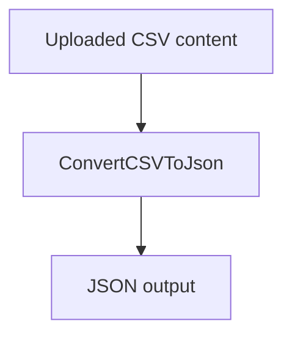
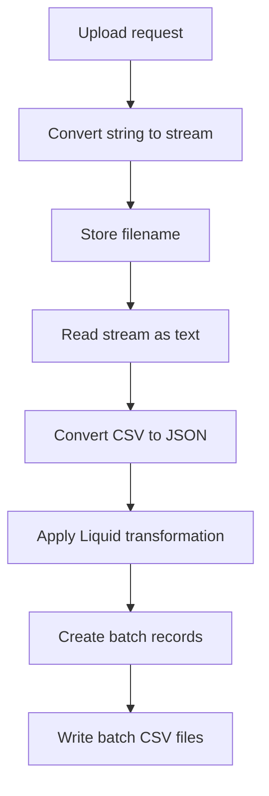
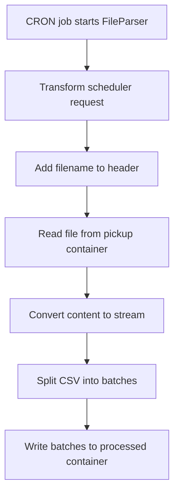
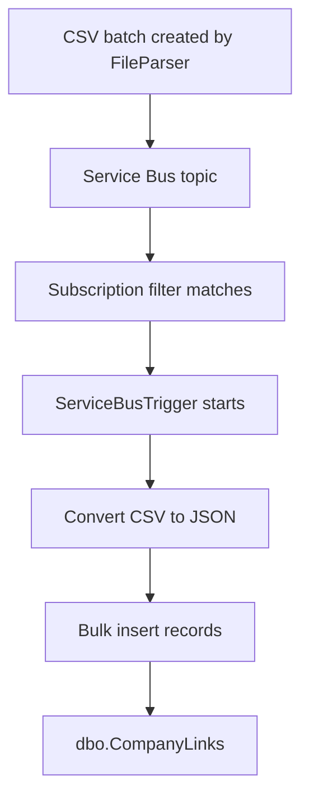
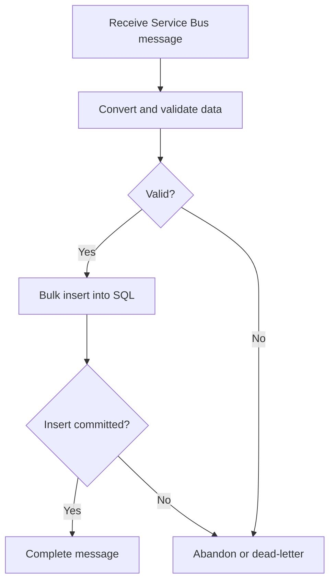
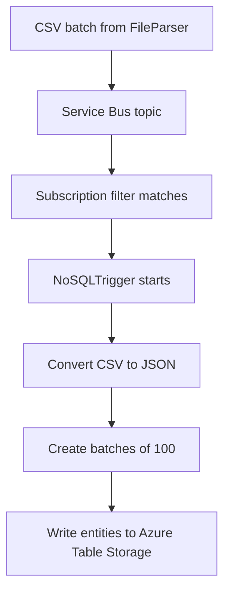
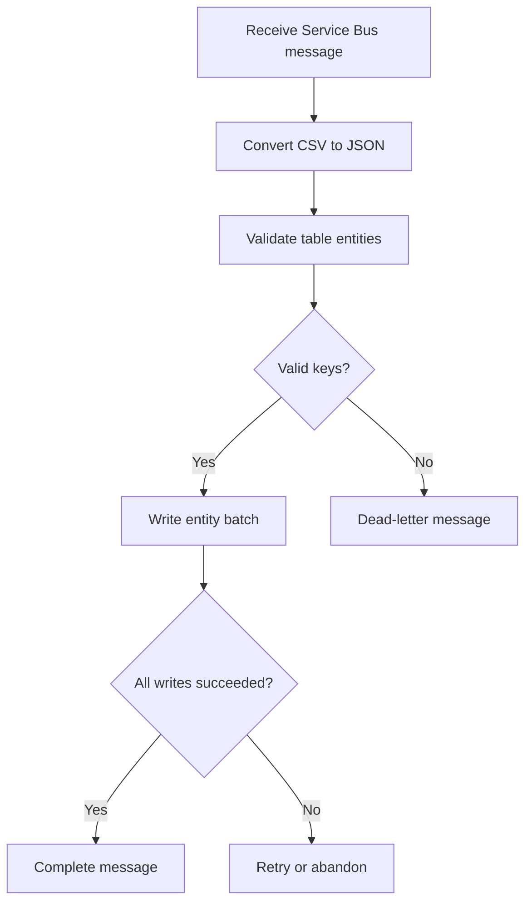

# UploadFileProcess documentation

`UploadFileProcess` is a Xenhey configuration-driven workflow for receiving file content, optionally converting or reading the input stream, converting CSV data to JSON, transforming records, and splitting the results into batch files for downstream processing.

In the current configuration, only `ConvertCSVToJson` is enabled. All other modules are disabled.

### 1. Process-level configuration

```json
{
  "Id": "UploadFileProcess",
  "LineOfBusinessProcessData": [
    {
      "Key": "object",
      "Type": "Xenhey.BPM.Core.Net8.Processes.ProcessData"
    }
  ],
  "Type": "",
  "DataFlowProcess": []
}
```

| Property                    | Value                                        | Explanation                                                                                      |
| --------------------------- | -------------------------------------------- | ------------------------------------------------------------------------------------------------ |
| `Id`                        | `UploadFileProcess`                          | Unique name used to identify and execute the workflow.                                           |
| `LineOfBusinessProcessData` | `object`                                     | Defines a shared process-data object available to workflow modules.                              |
| `ProcessData` type          | `Xenhey.BPM.Core.Net8.Processes.ProcessData` | Xenhey object used to carry the payload, metadata, filename, and intermediate results.           |
| `Type`                      | Empty                                        | No process-level implementation type is assigned. Processing is controlled by `DataFlowProcess`. |
| `DataFlowProcess`           | Array                                        | Ordered collection of workflow modules. Modules are evaluated in the order listed.               |

### 2. Module summary

|  # | Module key                            | Process type            | Enabled | Intended responsibility                                                        |
| -: | ------------------------------------- | ----------------------- | ------- | ------------------------------------------------------------------------------ |
|  1 | `ConvertStringToStream`               | `MessageBuilderProcess` | No      | Converts string content into a stream for stream-based processing.             |
|  2 | `StoreRequestInPayload`               | `MessageBuilderProcess` | No      | Stores selected request properties, such as `filename`, in the process object. |
|  3 | `ReadStreamToText`                    | `MessageBuilderProcess` | No      | Reads an input stream and converts it into plain text.                         |
|  4 | `ConvertCSVToJson`                    | `CSVProcess`            | **Yes** | Reads CSV text and converts the records into JSON.                             |
|  5 | `TransformRequestUsingLiquidTemplate` | `TransformationProcess` | No      | Applies a managed Liquid template to each JSON array record.                   |
|  6 | `CreateCSVBatchFilesForProcessing`    | `CSVProcess`            | No      | Creates batch metadata records, including Azure Table tracking records.        |
|  7 | `CreateCSVBatchFilesForProcessing`    | `CSVProcess`            | No      | Splits and writes CSV content into batch files in Blob Storage.                |

### Current active flow



If every module were enabled, the intended flow would resemble:



## Module 1: ConvertStringToStream

```json
{
  "Key": "ConvertStringToStream",
  "Type": "Xenhey.BPM.Core.Net8.Processes.MessageBuilderProcess",
  "Async": "false",
  "IsEnable": "false",
  "DataFlowProcessParameters": [
    {
      "Key": "ConvertStringToStream",
      "Value": "yes"
    }
  ]
}
```

| Property or parameter   | Value                   | Explanation                                                               |
| ----------------------- | ----------------------- | ------------------------------------------------------------------------- |
| `Type`                  | `MessageBuilderProcess` | Uses the Xenhey message-building and payload-conversion component.        |
| `Async`                 | `false`                 | The module completes before the next module starts.                       |
| `IsEnable`              | `false`                 | The module is currently skipped.                                          |
| `ConvertStringToStream` | `yes`                   | Instructs the module to convert the current string payload into a stream. |
| Expected input          | String                  | Uploaded file content represented as text.                                |
| Expected output         | Stream                  | A stream that can be consumed by later modules.                           |

Use this module when an endpoint receives file content as a string but a downstream component expects a stream.

## Module 2: StoreRequestInPayload

```json
{
  "Key": "StoreRequestInPayload",
  "Type": "Xenhey.BPM.Core.Net8.Processes.MessageBuilderProcess",
  "Async": "false",
  "IsEnable": "false",
  "DataFlowProcessParameters": [
    {
      "Key": "AddMessageToObject",
      "Value": "yes"
    },
    {
      "Key": "Filter",
      "Value": "[{\"Key\": \"payloadrequest\",\"Value\": \"filename\"}]"
    }
  ]
}
```

| Property or parameter | Value                       | Explanation                                                                            |
| --------------------- | --------------------------- | -------------------------------------------------------------------------------------- |
| `AddMessageToObject`  | `yes`                       | Adds selected values from the current request or message to the shared process object. |
| `Filter`              | `payloadrequest → filename` | Selects the `filename` property from `payloadrequest`.                                 |
| Expected input        | Request object              | Request containing a `payloadrequest.filename` property.                               |
| Expected output       | Updated process object      | Shared process data containing the filename or associated request metadata.            |
| Status                | Disabled                    | Filename extraction does not currently occur.                                          |

The `Filter` value is itself a JSON array stored as an escaped JSON string:

```json
[
  {
    "Key": "payloadrequest",
    "Value": "filename"
  }
]
```

A likely request structure is:

```json
{
  "payloadrequest": {
    "filename": "customers.csv"
  }
}
```

## Module 3: ReadStreamToText

```json
{
  "Key": "ReadStreamToText",
  "Type": "Xenhey.BPM.Core.Net8.Processes.MessageBuilderProcess",
  "Async": "false",
  "IsEnable": "false",
  "DataFlowProcessParameters": [
    {
      "Key": "ReadStreamToText",
      "Value": "yes"
    }
  ]
}
```

| Property or parameter | Value       | Explanation                                                                 |
| --------------------- | ----------- | --------------------------------------------------------------------------- |
| `ReadStreamToText`    | `yes`       | Reads the current stream and replaces or supplements the payload with text. |
| Expected input        | Stream      | Uploaded file stream.                                                       |
| Expected output       | String      | Plain-text contents of the uploaded file.                                   |
| Execution             | Synchronous | The text must be available before the next module executes.                 |
| Status                | Disabled    | No stream-to-text conversion currently occurs.                              |

This module would normally be enabled when the CSV converter expects plain-text CSV rather than a binary or file stream.

## Module 4: ConvertCSVToJson

```json
{
  "Key": "ConvertCSVToJson",
  "Type": "Xenhey.BPM.Core.Net8.Processes.CSVProcess",
  "Async": "false",
  "IsEnable": "true",
  "DataFlowProcessParameters": [
    {
      "Key": "ReadCSVAsPlainText",
      "Value": "yes"
    },
    {
      "Key": "messageformat",
      "Value": "application/json"
    }
  ]
}
```

| Property or parameter | Value              | Explanation                                        |
| --------------------- | ------------------ | -------------------------------------------------- |
| `Type`                | `CSVProcess`       | Uses the Xenhey CSV-processing module.             |
| `ReadCSVAsPlainText`  | `yes`              | Treats the incoming payload as CSV-formatted text. |
| `messageformat`       | `application/json` | Sets the resulting message format to JSON.         |
| Expected input        | CSV text           | CSV content, normally including a header row.      |
| Expected output       | JSON array         | One JSON object for each CSV data row.             |
| Status                | **Enabled**        | This is the only module currently executed.        |

Example input:

```csv
CustomerId,CustomerName,Region
1001,Contoso,East
1002,Fabrikam,Central
```

Expected conceptual output:

```json
[
  {
    "CustomerId": "1001",
    "CustomerName": "Contoso",
    "Region": "East"
  },
  {
    "CustomerId": "1002",
    "CustomerName": "Fabrikam",
    "Region": "Central"
  }
]
```

The exact data types depend on how `CSVProcess` performs type inference. Values may remain strings unless the module explicitly converts numbers, dates, or Boolean values.

## Module 5: TransformRequestUsingLiquidTemplate

```json
{
  "Key": "TransformRequestUsingLiquidTemplate",
  "Type": "Xenhey.BPM.Core.Net8.Processes.TransformationProcess",
  "Async": "false",
  "IsEnable": "false",
  "DataFlowProcessParameters": [
    {
      "Key": "TransformJSONPayloadArray",
      "Value": "yes"
    },
    {
      "Key": "ManagedTemplateName",
      "Value": "yes"
    },
    {
      "Key": "FileName",
      "Value": "data.liquid"
    },
    {
      "Key": "Container",
      "Value": "config"
    },
    {
      "Key": "StorageAccount",
      "Value": "AzureWebJobsStorage"
    }
  ]
}
```

| Property or parameter       | Value                   | Explanation                                                               |
| --------------------------- | ----------------------- | ------------------------------------------------------------------------- |
| `Type`                      | `TransformationProcess` | Uses the Xenhey data-transformation component.                            |
| `TransformJSONPayloadArray` | `yes`                   | Applies the transformation to a JSON array payload.                       |
| `ManagedTemplateName`       | `yes`                   | Indicates that the Liquid template is managed or retrieved by name.       |
| `FileName`                  | `data.liquid`           | Liquid template file to load.                                             |
| `Container`                 | `config`                | Blob container holding the template.                                      |
| `StorageAccount`            | `AzureWebJobsStorage`   | Application-setting name containing the storage connection configuration. |
| Expected input              | JSON array              | Output produced by `ConvertCSVToJson`.                                    |
| Expected output             | Transformed JSON        | JSON records mapped to the required downstream schema.                    |
| Status                      | Disabled                | No Liquid transformation currently occurs.                                |

The expected template location is conceptually:

```text
AzureWebJobsStorage
└── config
    └── data.liquid
```

Example Liquid template:

```liquid
{
  "customerId": "{{ CustomerId }}",
  "customerName": "{{ CustomerName }}",
  "region": "{{ Region }}",
  "source": "CSVUpload"
}
```

## Module 6: Create Azure Table batch records

```json
{
  "Key": "CreateCSVBatchFilesForProcessing",
  "Type": "Xenhey.BPM.Core.Net8.Processes.CSVProcess",
  "Async": "false",
  "IsEnable": "false",
  "DataFlowProcessParameters": [
    {
      "Key": "StorageAccount",
      "Value": "AzureWebJobsStorage"
    },
    {
      "Key": "CreateRecordForAzureTableBatch",
      "Value": "Yes"
    },
    {
      "Key": "BatchSize",
      "Value": "201"
    },
    {
      "Key": "FolderName",
      "Value": "CSVFiles"
    },
    {
      "Key": "TableName",
      "Value": "csvbatchfiles"
    },
    {
      "Key": "Container",
      "Value": "processed"
    },
    {
      "Key": "FileExtension",
      "Value": ".csv"
    },
    {
      "Key": "ContentType",
      "Value": "csv/text"
    }
  ]
}
```

| Property or parameter            | Value           | Explanation                                                                     |
| -------------------------------- | --------------- | ------------------------------------------------------------------------------- |
| `CreateRecordForAzureTableBatch` | `Yes`           | Creates tracking or processing records for generated CSV batches.               |
| `BatchSize`                      | `201`           | Configures the number of CSV records associated with each generated batch.      |
| `FolderName`                     | `CSVFiles`      | Logical folder used for generated batch files.                                  |
| `TableName`                      | `csvbatchfiles` | Azure Table used to track batch metadata or processing state.                   |
| `Container`                      | `processed`     | Blob container used for processed output.                                       |
| `FileExtension`                  | `.csv`          | File extension assigned to generated batch files.                               |
| `ContentType`                    | `csv/text`      | Content type assigned by the workflow. Consider whether `text/csv` is required. |
| Expected output                  | Table records   | One or more tracking records describing batch files.                            |
| Status                           | Disabled        | No batch tracking records are currently created.                                |

A conceptual tracking record might look like:

```json
{
  "PartitionKey": "UploadFileProcess",
  "RowKey": "batch-0001",
  "FileName": "CSVFiles/batch-0001.csv",
  "Container": "processed",
  "RecordCount": 201,
  "Status": "Pending"
}
```

## Module 7: Write CSV batch files to storage

```json
{
  "Key": "CreateCSVBatchFilesForProcessing",
  "Type": "Xenhey.BPM.Core.Net8.Processes.CSVProcess",
  "Async": "false",
  "IsEnable": "false",
  "DataFlowProcessParameters": [
    {
      "Key": "StorageAccount",
      "Value": "AzureWebJobsStorage"
    },
    {
      "Key": "WriteCsvToStorageAsBatch",
      "Value": "Yes"
    },
    {
      "Key": "BatchSize",
      "Value": "201"
    },
    {
      "Key": "FolderName",
      "Value": "CSVFiles"
    },
    {
      "Key": "TableName",
      "Value": "csvbatchfiles"
    },
    {
      "Key": "Container",
      "Value": "processed"
    },
    {
      "Key": "FileExtension",
      "Value": ".csv"
    },
    {
      "Key": "ContentType",
      "Value": "csv/text"
    }
  ]
}
```

| Property or parameter      | Value                      | Explanation                                                                |
| -------------------------- | -------------------------- | -------------------------------------------------------------------------- |
| `WriteCsvToStorageAsBatch` | `Yes`                      | Splits the CSV data and writes each group as a separate Blob Storage file. |
| `BatchSize`                | `201`                      | Maximum configured number of CSV records per output file.                  |
| `FolderName`               | `CSVFiles`                 | Blob virtual directory for the output files.                               |
| `Container`                | `processed`                | Destination Blob Storage container.                                        |
| `TableName`                | `csvbatchfiles`            | Tracking table that may be updated after the files are written.            |
| `FileExtension`            | `.csv`                     | Output file extension.                                                     |
| `ContentType`              | `csv/text`                 | Blob content type. The conventional MIME type is `text/csv`.               |
| Expected input             | CSV or transformed records | Dataset to split into smaller batches.                                     |
| Expected output            | Multiple CSV blobs         | Batch files stored under `processed/CSVFiles`.                             |
| Status                     | Disabled                   | No files are currently written.                                            |

Conceptual storage structure:

```text
processed
└── CSVFiles
    ├── batch-0001.csv
    ├── batch-0002.csv
    └── batch-0003.csv
```

## Configuration observations

| Observation                            | Impact                                                                                                        | Recommendation                                                                               |
| -------------------------------------- | ------------------------------------------------------------------------------------------------------------- | -------------------------------------------------------------------------------------------- |
| Only `ConvertCSVToJson` is enabled     | The process stops after producing JSON.                                                                       | Enable additional modules according to the required workflow.                                |
| Modules 6 and 7 use the same `Key`     | Logging, lookup, diagnostics, or module-specific configuration may be ambiguous.                              | Assign unique keys such as `CreateAzureTableBatchRecords` and `WriteCSVBatchFilesToStorage`. |
| `BatchSize` is `201`                   | If this represents an Azure Table transactional batch, it exceeds Azure Table’s 100-entity transaction limit. | Confirm whether it refers to CSV rows per file or Azure Table transaction size.              |
| `ContentType` is `text/csv`            | This is the conventional CSV MIME type.                                                                   | Use `text/csv` unless Xenhey specifically requires `csv/text`.                               |
| Boolean settings are strings           | The runtime must parse `"true"`, `"false"`, `"yes"`, and `"Yes"` consistently.                                | Standardize casing and values if supported.                                                  |
| Root `Type` is empty                   | May be intentional for configuration-driven execution.                                                        | Confirm that no process-level type is required.                                              |
| Stream conversion modules are disabled | The enabled CSV module must receive plain CSV text directly.                                                  | Enable stream conversion only when the upload endpoint returns a stream or encoded content.  |

A clearer naming pattern for the final modules would be:

```json
{
  "Key": "CreateAzureTableBatchRecords",
  "Type": "Xenhey.BPM.Core.Net8.Processes.CSVProcess"
}
```

```json
{
  "Key": "WriteCSVBatchFilesToStorage",
  "Type": "Xenhey.BPM.Core.Net8.Processes.CSVProcess"
}
```
# FileParser

`FileParser` is a configuration-driven Xenhey workflow designed to process large CSV files delivered through SFTP to a shared Azure Storage location.

A scheduled CRON job initiates the workflow. The modules then execute sequentially to:

1. Extract the file information from the scheduler request.
2. add the filename to the message headers.
3. retrieve the large file from Azure Blob Storage.
4. convert the retrieved content into a stream.
5. split the file into manageable CSV batches.
6. write the batch files to an Azure Storage container for downstream processing.

This pattern is useful for large-file migrations, bulk data ingestion, ETL workloads, and integrations where processing an entire file in one transaction could cause memory, timeout, or performance problems.

## Process overview



## Process-level configuration

```json
{
  "Id": "FileParser",
  "LineOfBusinessProcessData": [
    {
      "Key": "object",
      "Type": "Xenhey.BPM.Core.Net8.Processes.ProcessData"
    }
  ],
  "Type": "",
  "DataFlowProcess": []
}
```

| Property                    | Value                                        | Description                                                                                      |
| --------------------------- | -------------------------------------------- | ------------------------------------------------------------------------------------------------ |
| `Id`                        | `FileParser`                                 | Unique name used to identify and invoke the workflow.                                            |
| `LineOfBusinessProcessData` | `object`                                     | Defines the shared process-data object passed between modules.                                   |
| `ProcessData`               | `Xenhey.BPM.Core.Net8.Processes.ProcessData` | Xenhey object that carries the payload, headers, filename, file content, and processing results. |
| `Type`                      | Empty                                        | The workflow is driven by the modules in `DataFlowProcess`.                                      |
| `DataFlowProcess`           | Array                                        | Ordered list of modules executed by the workflow.                                                |

## Module summary

| Sequence | Module                             | Type                    | Purpose                                                                   |
| -------: | ---------------------------------- | ----------------------- | ------------------------------------------------------------------------- |
|        1 | `TransFerDataToInformation`        | `TransformationProcess` | Transforms the CRON request into the required file-processing request.    |
|        2 | `AddPayloadToHeader`               | `HeaderInfoProcess`     | Copies the filename from the payload into the `FileName` header.          |
|        3 | `BlobStorageProcess`               | `BlobStorageProcess`    | Retrieves the source file from the `pickup` container.                    |
|        4 | `ConvertStringToStream`            | `MessageBuilderProcess` | Converts the retrieved file content into a stream.                        |
|        5 | `CreateCSVBatchFilesForProcessing` | `CSVProcess`            | Splits the CSV into batches and writes them to the `processed` container. |

All five modules are enabled and run synchronously in the order shown.

---

## Module 1: Transform file information

```json
{
  "Key": "TransFerDataToInformation",
  "Type": "Xenhey.BPM.Core.Net8.Processes.TransformationProcess",
  "Async": "false",
  "IsEnable": "true",
  "DataFlowProcessParameters": [
    {
      "Key": "TransformJSONPayload",
      "Value": "yes"
    },
    {
      "Key": "RemoteTemplateName",
      "Value": "yes"
    },
    {
      "Key": "remoteURL",
      "Value": "https://www.xenhey.com/api/store/5E382B920AA64C11996B88785FE922D3"
    }
  ]
}
```

### Responsibility

This module transforms the request supplied by the CRON job into the JSON structure required by the remaining FileParser modules.

The transformation template is retrieved from a Xenhey remote configuration endpoint. This allows the transformation rules to be changed without rebuilding or redeploying the application.

| Setting                | Value                   | Description                                                          |
| ---------------------- | ----------------------- | -------------------------------------------------------------------- |
| `Type`                 | `TransformationProcess` | Executes a data transformation against the current message payload.  |
| `Async`                | `false`                 | Waits for the transformation to finish before continuing.            |
| `IsEnable`             | `true`                  | The module is active.                                                |
| `TransformJSONPayload` | `yes`                   | Treats the incoming payload as JSON and transforms it.               |
| `RemoteTemplateName`   | `yes`                   | Instructs the process to retrieve its template from a remote source. |
| `remoteURL`            | Xenhey store URL        | Location of the managed transformation template.                     |
| Expected input         | CRON request            | Scheduler message containing source-file information.                |
| Expected output        | Transformed JSON        | Payload containing a normalized `filename` property.                 |

A conceptual transformed payload would be:

```json
{
  "filename": "customer-data-20260804.csv"
}
```

The actual result depends on the transformation template returned by the remote URL.

### Operational consideration

The remote transformation endpoint must be available when the workflow runs. A timeout, invalid response, or unavailable template should stop processing before the storage module is called.

---

## Module 2: Add the filename to the header

```json
{
  "Key": "AddPayloadToHeader",
  "Type": "Xenhey.BPM.Core.Net8.Processes.HeaderInfoProcess",
  "Async": "false",
  "IsEnable": "true",
  "DataFlowProcessParameters": [
    {
      "Key": "AddFilteredPayloadDataToHeaders",
      "Value": "yes"
    },
    {
      "Key": "filters",
      "Value": "[{\"Key\": \"FileName\",\"Value\": \"filename\"}]"
    }
  ]
}
```

### Responsibility

This module reads the `filename` property from the transformed payload and adds it to the message headers as `FileName`.

The Blob Storage module then uses this header to determine which file to retrieve.

| Setting                           | Value                 | Description                                                 |
| --------------------------------- | --------------------- | ----------------------------------------------------------- |
| `Type`                            | `HeaderInfoProcess`   | Manages message-header information.                         |
| `Async`                           | `false`               | Completes the header update before the storage module runs. |
| `IsEnable`                        | `true`                | The module is active.                                       |
| `AddFilteredPayloadDataToHeaders` | `yes`                 | Copies selected payload properties into message headers.    |
| `filters`                         | `FileName → filename` | Maps payload property `filename` to header `FileName`.      |
| Expected input                    | JSON payload          | Payload containing `filename`.                              |
| Expected output                   | Updated headers       | Message containing the `FileName` header.                   |

The escaped `filters` setting represents:

```json
[
  {
    "Key": "FileName",
    "Value": "filename"
  }
]
```

Conceptual input:

```json
{
  "filename": "customer-data-20260804.csv"
}
```

Resulting message header:

```json
{
  "FileName": "customer-data-20260804.csv"
}
```

The property names are case-sensitive unless Xenhey performs case-insensitive matching. The `FileName` header must match the `headername` configured in the next module.

---

## Module 3: Retrieve the file from Azure Blob Storage

```json
{
  "Key": "BlobStorageProcess",
  "Type": "Xenhey.BPM.Core.Net8.Processes.BlobStorageProcess",
  "Async": "false",
  "IsEnable": "true",
  "DataFlowProcessParameters": [
    {
      "Key": "ReadFileNameFromHeader",
      "Value": "yes"
    },
    {
      "Key": "StorageAccount",
      "Value": "AzureWebJobsStorage"
    },
    {
      "Key": "Container",
      "Value": "pickup"
    },
    {
      "Key": "headername",
      "Value": "FileName"
    }
  ]
}
```

### Responsibility

This module retrieves the source file from the `pickup` container in Azure Blob Storage.

The name of the file is read dynamically from the `FileName` message header populated by the preceding module.

| Setting                  | Value                 | Description                                                                |
| ------------------------ | --------------------- | -------------------------------------------------------------------------- |
| `Type`                   | `BlobStorageProcess`  | Executes Azure Blob Storage operations.                                    |
| `Async`                  | `false`               | Waits until the file has been retrieved.                                   |
| `IsEnable`               | `true`                | The module is active.                                                      |
| `ReadFileNameFromHeader` | `yes`                 | Reads the source filename from a message header.                           |
| `StorageAccount`         | `AzureWebJobsStorage` | Application setting containing the Azure Storage connection configuration. |
| `Container`              | `pickup`              | Source container holding SFTP-delivered files.                             |
| `headername`             | `FileName`            | Name of the header containing the source filename.                         |
| Expected input           | `FileName` header     | Name or relative path of the blob to retrieve.                             |
| Expected output          | File content          | CSV file content passed to the next module.                                |

Conceptual storage structure:

```text
Azure Storage account
├── pickup
│   └── customer-data-20260804.csv
└── processed
```

### SFTP relationship

When SFTP support is enabled for the Azure Storage account, an external system can upload the large CSV file into the `pickup` container or its assigned home directory.

The FileParser workflow does not perform the SFTP transfer itself. It processes the file after the transfer has completed and the CRON job identifies it for processing.

The CRON job should avoid selecting files that are still being uploaded. A common pattern is to upload with a temporary extension and rename the file to `.csv` after the transfer completes.

---

## Module 4: Convert the file content into a stream

```json
{
  "Key": "ConvertStringToStream",
  "Type": "Xenhey.BPM.Core.Net8.Processes.MessageBuilderProcess",
  "Async": "false",
  "IsEnable": "true",
  "DataFlowProcessParameters": [
    {
      "Key": "ConvertStringToStream",
      "Value": "yes"
    }
  ]
}
```

### Responsibility

This module converts the file content returned by `BlobStorageProcess` from a string into a stream.

The CSV batching module can then read the file sequentially and create smaller output files.

| Setting                 | Value                   | Description                                               |
| ----------------------- | ----------------------- | --------------------------------------------------------- |
| `Type`                  | `MessageBuilderProcess` | Converts or restructures the current message payload.     |
| `Async`                 | `false`                 | Completes stream creation before batch processing begins. |
| `IsEnable`              | `true`                  | The module is active.                                     |
| `ConvertStringToStream` | `yes`                   | Converts the current string payload into a stream.        |
| Expected input          | String                  | CSV file content returned by Blob Storage.                |
| Expected output         | Stream                  | Stream containing the CSV content.                        |

Conceptually:

```text
CSV string
   ↓
Memory or processing stream
   ↓
CSV batch processor
```

For extremely large files, the most scalable implementation is to stream the blob directly from Azure Storage instead of first loading the entire file into a string. That avoids holding two representations—the string and the stream—in application memory.

---

## Module 5: Create and store CSV batch files

```json
{
  "Key": "CreateCSVBatchFilesForProcessing",
  "Type": "Xenhey.BPM.Core.Net8.Processes.CSVProcess",
  "Async": "false",
  "IsEnable": "true",
  "DataFlowProcessParameters": [
    {
      "Key": "StorageAccount",
      "Value": "AzureWebJobsStorage"
    },
    {
      "Key": "WriteCsvToStorageAsBatch",
      "Value": "Yes"
    },
    {
      "Key": "BatchSize",
      "Value": "201"
    },
    {
      "Key": "FolderName",
      "Value": "CSVFiles"
    },
    {
      "Key": "TableName",
      "Value": "csvbatchfiles"
    },
    {
      "Key": "Container",
      "Value": "processed"
    },
    {
      "Key": "FileExtension",
      "Value": ".csv"
    },
    {
      "Key": "ContentType",
      "Value": "csv/text"
    }
  ]
}
```

### Responsibility

This module reads the CSV stream, divides the source data into batches of 201 records, and writes each batch as a separate CSV file in the `processed` container.

Smaller files can then be processed independently by downstream Azure Functions, event-driven workflows, database loaders, or Xenhey processes.

| Setting                    | Value                 | Description                                                           |
| -------------------------- | --------------------- | --------------------------------------------------------------------- |
| `Type`                     | `CSVProcess`          | Executes CSV parsing, batching, and storage operations.               |
| `Async`                    | `false`               | Waits until all batch files have been created.                        |
| `IsEnable`                 | `true`                | The module is active.                                                 |
| `StorageAccount`           | `AzureWebJobsStorage` | Storage connection setting used for the output files.                 |
| `WriteCsvToStorageAsBatch` | `Yes`                 | Enables splitting and writing the CSV into batch files.               |
| `BatchSize`                | `201`                 | Configured number of records per output batch.                        |
| `FolderName`               | `CSVFiles`            | Virtual folder created inside the destination container.              |
| `TableName`                | `csvbatchfiles`       | Azure Table name available for batch tracking or processing metadata. |
| `Container`                | `processed`           | Destination container for generated files.                            |
| `FileExtension`            | `.csv`                | Extension assigned to each batch file.                                |
| `ContentType`              | `csv/text`            | Content type assigned to generated blobs.                             |
| Expected input             | CSV stream            | Stream produced by `ConvertStringToStream`.                           |
| Expected output            | CSV batch files       | Multiple files containing smaller groups of source records.           |

Conceptual output:

```text
processed
└── CSVFiles
    ├── customer-data-batch-0001.csv
    ├── customer-data-batch-0002.csv
    ├── customer-data-batch-0003.csv
    └── customer-data-batch-0004.csv
```

For example, a source file containing 1,000 records with a batch size of 201 would conceptually produce:

|     Batch |   Records |
| --------: | --------: |
|         1 |       201 |
|         2 |       201 |
|         3 |       201 |
|         4 |       201 |
|         5 |       196 |
| **Total** | **1,000** |

Whether the CSV header row is included in every output file depends on the implementation of `CSVProcess`. It should be included in each batch when every generated file must be independently processable.

## End-to-end data flow

| Stage | Input                  | Action                                              | Output                                  |
| ----: | ---------------------- | --------------------------------------------------- | --------------------------------------- |
|     1 | CRON scheduler request | Normalize request using remote transformation rules | JSON containing `filename`              |
|     2 | Transformed JSON       | Copy `filename` to the `FileName` header            | Updated message headers                 |
|     3 | `FileName` header      | Retrieve the corresponding blob from `pickup`       | Source CSV content                      |
|     4 | CSV string             | Convert content into a stream                       | CSV stream                              |
|     5 | CSV stream             | Split records into batches of 201                   | CSV batch files in `processed/CSVFiles` |
|     6 | Batch files            | Make files available to downstream processors       | Scalable bulk-processing workflow       |

## Recommended operational controls

| Control              | Recommendation                                                                                  |
| -------------------- | ----------------------------------------------------------------------------------------------- |
| File completion      | Process only files whose SFTP upload has completed.                                             |
| Duplicate prevention | Maintain a tracking record using filename, blob ETag, size, or checksum.                        |
| File status          | Track states such as `Discovered`, `Processing`, `Completed`, and `Failed`.                     |
| Error handling       | Move failed source files to an `error` container and record the failure reason.                 |
| Archive              | Move successfully processed source files from `pickup` to an `archive` container.               |
| Batch traceability   | Include the source filename, batch number, record count, and correlation ID in batch metadata.  |
| Header handling      | Confirm that every batch file includes the original CSV header row.                             |
| Encoding             | Define the supported encoding, preferably UTF-8.                                                |
| Delimiter            | Define whether the parser accepts commas only or configurable delimiters.                       |
| File validation      | Validate extension, size, headers, required columns, and malformed rows before batching.        |
| Observability        | Log the source filename, total records, batch count, duration, and failure details.             |
| Security             | Prefer managed identity and RBAC over storage account connection strings where supported.       |
| MIME type            | Consider changing `csv/text` to the standard `text/csv`.                                        |
| Large-file memory    | Stream directly from Blob Storage when possible instead of loading the entire file as a string. |

## solution summary

The Xenhey `FileParser` workflow provides a scalable approach for processing large CSV files delivered through SFTP to Azure Storage. A scheduled CRON job starts the workflow, which identifies the target file, retrieves it from the `pickup` container, converts the file content into a processable stream, and divides the data into smaller batches. The generated CSV batch files are written to the `processed/CSVFiles` location, where they can be processed independently by downstream services. This approach is especially valuable for large-file migrations and bulk data-ingestion workloads because it reduces memory pressure, limits processing time per batch, improves recoverability, and allows downstream processing to scale horizontally.

# Read Message from Service Bus into SQL


The `ServiceBusTrigger` workflow is an event-driven Xenhey process that consumes messages from an Azure Service Bus topic subscription and loads the message data into an Azure SQL Database.

When a message matches the configured topic subscription or consumer filter, the Service Bus trigger invokes this workflow. The workflow converts the CSV message content into JSON and then performs a bulk insert into the `dbo.CompanyLinks` SQL table.

This pattern is useful for scalable data ingestion because Service Bus decouples file-processing workloads from database loading. Each batch can be processed independently, retried when a temporary failure occurs, and moved to a dead-letter queue when it cannot be processed successfully.

## Process overview



## Process-level configuration

```json
{
  "Id": "ServiceBusTrigger",
  "LineOfBusinessProcessData": [
    {
      "Key": "object",
      "Type": "Xenhey.BPM.Core.Net8.Processes.ProcessData"
    }
  ],
  "Type": "",
  "DataFlowProcess": []
}
```

| Property                    | Value                                        | Description                                                            |
| --------------------------- | -------------------------------------------- | ---------------------------------------------------------------------- |
| `Id`                        | `ServiceBusTrigger`                          | Identifies the workflow invoked by the Service Bus consumer.           |
| `LineOfBusinessProcessData` | `object`                                     | Defines the shared process object used by the workflow modules.        |
| `ProcessData`               | `Xenhey.BPM.Core.Net8.Processes.ProcessData` | Carries the message body, headers, metadata, and intermediate results. |
| `Type`                      | Empty                                        | The workflow is controlled by its `DataFlowProcess` modules.           |
| `DataFlowProcess`           | Array                                        | Ordered list of modules executed for each received message.            |

The Service Bus namespace, topic, subscription, filters, connection configuration, and message-settlement behavior are not defined in this JSON. Those settings are expected to be configured by the Azure Function trigger, worker service, or Xenhey hosting environment that invokes `ServiceBusTrigger`.

## Module summary

| Sequence | Module                                       | Type                 | Purpose                                                     |
| -------: | -------------------------------------------- | -------------------- | ----------------------------------------------------------- |
|        1 | `ReadFileConvertToJsonforSQLDb`              | `CSVProcess`         | Converts the CSV message content into JSON records.         |
|        2 | `ReceiveMessageFromServieBusWriteToAzureSQL` | `ConnectToDBProcess` | Bulk inserts the converted records into `dbo.CompanyLinks`. |

Both modules are enabled and execute synchronously.

---

## Module 1: Convert the CSV message to JSON

```json
{
  "Key": "ReadFileConvertToJsonforSQLDb",
  "Type": "Xenhey.BPM.Core.Net8.Processes.CSVProcess",
  "Async": "false",
  "IsEnable": "true",
  "DataFlowProcessParameters": [
    {
      "Key": "ReadCSVAsPlainText",
      "Value": "yes"
    },
    {
      "Key": "messageformat",
      "Value": "application/json"
    }
  ]
}
```

### Responsibility

This module reads the Service Bus message body as plain-text CSV and converts each CSV row into a JSON object.

The resulting JSON collection becomes the input for the SQL database module.

| Setting              | Value                           | Description                                                  |
| -------------------- | ------------------------------- | ------------------------------------------------------------ |
| `Key`                | `ReadFileConvertToJsonforSQLDb` | Identifies the CSV conversion module.                        |
| `Type`               | `CSVProcess`                    | Uses the Xenhey CSV-processing component.                    |
| `Async`              | `false`                         | The conversion must finish before the SQL module begins.     |
| `IsEnable`           | `true`                          | The module is active.                                        |
| `ReadCSVAsPlainText` | `yes`                           | Treats the Service Bus message body as CSV text.             |
| `messageformat`      | `application/json`              | Sets the converted output format to JSON.                    |
| Expected input       | CSV text                        | Service Bus message body containing CSV headers and records. |
| Expected output      | JSON array                      | Collection of objects representing CSV rows.                 |

Example Service Bus message body:

```csv
CompanyId,CompanyName,WebsiteUrl,Category
1001,Contoso,https://www.contoso.com,Technology
1002,Fabrikam,https://www.fabrikam.com,Manufacturing
```

Conceptual converted output:

```json
[
  {
    "CompanyId": "1001",
    "CompanyName": "Contoso",
    "WebsiteUrl": "https://www.contoso.com",
    "Category": "Technology"
  },
  {
    "CompanyId": "1002",
    "CompanyName": "Fabrikam",
    "WebsiteUrl": "https://www.fabrikam.com",
    "Category": "Manufacturing"
  }
]
```

The CSV column names should match the destination SQL table’s expected column names or the mapping rules implemented by `ConnectToDBProcess`.

---

## Module 2: Bulk insert records into Azure SQL

```json
{
  "Key": "ReceiveMessageFromServieBusWriteToAzureSQL",
  "Type": "Xenhey.BPM.Core.Net8.Processes.ConnectToDBProcess",
  "Async": "false",
  "IsEnable": "true",
  "DataFlowProcessParameters": [
    {
      "Key": "ConnectToDatabaseBulkInsertFromCSVToDB",
      "Value": "yes"
    },
    {
      "Key": "DatabaseTableName",
      "Value": "dbo.CompanyLinks"
    },
    {
      "Key": "ConnectionString",
      "Value": "DatabaseConnection"
    },
    {
      "Key": "datatable",
      "Value": "dbo.CompanyLinks"
    }
  ]
}
```

### Responsibility

This module connects to Azure SQL Database and performs a bulk insert of the converted message records into the `dbo.CompanyLinks` table.

Bulk insertion is more efficient than inserting records one at a time because the database receives and processes a batch of rows in a single operation.

| Setting                                  | Value                                        | Description                                                                 |
| ---------------------------------------- | -------------------------------------------- | --------------------------------------------------------------------------- |
| `Key`                                    | `ReceiveMessageFromServieBusWriteToAzureSQL` | Identifies the SQL-loading module.                                          |
| `Type`                                   | `ConnectToDBProcess`                         | Uses the Xenhey database connectivity component.                            |
| `Async`                                  | `false`                                      | The workflow waits for the database operation to complete.                  |
| `IsEnable`                               | `true`                                       | The module is active.                                                       |
| `ConnectToDatabaseBulkInsertFromCSVToDB` | `yes`                                        | Enables bulk insertion into the database.                                   |
| `DatabaseTableName`                      | `dbo.CompanyLinks`                           | Fully qualified destination SQL table.                                      |
| `ConnectionString`                       | `DatabaseConnection`                         | Application-setting name containing the database connection configuration.  |
| `datatable`                              | `dbo.CompanyLinks`                           | Identifies the destination data-table structure used by the bulk operation. |
| Expected input                           | Converted records                            | Records produced by the CSV module.                                         |
| Expected output                          | Database result                              | Successful row count or database exception.                                 |

Conceptual SQL destination:

```sql
CREATE TABLE dbo.CompanyLinks
(
    CompanyId   int            NOT NULL,
    CompanyName nvarchar(200)  NOT NULL,
    WebsiteUrl  nvarchar(500)  NULL,
    Category    nvarchar(100)  NULL
);
```

The actual SQL table definition must be used when validating the incoming CSV schema.

## End-to-end execution sequence

| Stage | Component              | Action                                                   | Result                                 |
| ----: | ---------------------- | -------------------------------------------------------- | -------------------------------------- |
|     1 | FileParser or producer | Creates a CSV data batch                                 | CSV batch available for processing     |
|     2 | Message producer       | Publishes the batch content to a Service Bus topic       | Message becomes available              |
|     3 | Topic subscription     | Evaluates subscription filters                           | Matching consumer receives the message |
|     4 | `ServiceBusTrigger`    | Starts the Xenhey workflow                               | Shared process object created          |
|     5 | `CSVProcess`           | Converts CSV text into JSON records                      | Structured record collection           |
|     6 | `ConnectToDBProcess`   | Maps and bulk inserts the records                        | Rows written to `dbo.CompanyLinks`     |
|     7 | Service Bus consumer   | Completes the message after the SQL transaction succeeds | Message removed from the subscription  |

## Recommended message-settlement behavior



| Result                                          | Recommended Service Bus action                                  |
| ----------------------------------------------- | --------------------------------------------------------------- |
| CSV conversion succeeds and SQL commit succeeds | Complete the message.                                           |
| Temporary SQL connectivity failure              | Abandon the message so it can be retried.                       |
| SQL throttling or transient timeout             | Retry with exponential backoff.                                 |
| Invalid CSV headers or malformed data           | Dead-letter the message with a clear reason.                    |
| Required SQL column missing                     | Dead-letter or route to a validation-failure queue.             |
| Maximum delivery count reached                  | Allow Service Bus to move the message to the dead-letter queue. |
| Duplicate message detected                      | Skip the insert safely and complete the message.                |

The message should only be completed after the SQL bulk-insert transaction commits successfully. Completing it earlier could result in lost data if the SQL operation subsequently fails.

## Configuration observations

| Observation                                                                | Impact                                                                            | Recommendation                                                                         |
| -------------------------------------------------------------------------- | --------------------------------------------------------------------------------- | -------------------------------------------------------------------------------------- |
| The module key contains `ServieBus`                                        | Reduces consistency in logs and operational searches.                             | Rename it to `ReceiveMessageFromServiceBusWriteToAzureSQL` when compatibility permits. |
| CSV is converted to JSON before an operation named `BulkInsertFromCSVToDB` | The module name suggests it might expect CSV, while its actual input may be JSON. | Confirm the input contract supported by `ConnectToDBProcess`.                          |
| `DatabaseTableName` and `datatable` contain the same value                 | This may be required by Xenhey, but the settings appear redundant.                | Document the distinct purpose of each setting or consolidate them if supported.        |
| No explicit column mapping is present                                      | Bulk loading may depend entirely on matching CSV and SQL column names.            | Validate headers before attempting the insert.                                         |
| No transaction behavior is shown                                           | A partial insert could create inconsistent results.                               | Execute each message batch inside a database transaction.                              |
| No duplicate protection is shown                                           | Service Bus provides at-least-once delivery, so a message may be processed again. | Use `MessageId`, `BatchId`, or a source-file/batch identifier as an idempotency key.   |
| Connection setting is named `DatabaseConnection`                           | The workflow depends on external application configuration.                       | Store secrets securely or use managed identity where supported.                        |

## solution summary

The `ServiceBusTrigger` workflow acts as a consumer for an Azure Service Bus topic subscription. When an incoming message satisfies the subscription’s consumer filter, Xenhey starts the workflow and reads the message body as CSV-formatted data. The CSV records are converted into structured JSON and then inserted in bulk into the `dbo.CompanyLinks` table in Azure SQL Database.

This event-driven pattern supports reliable and scalable ingestion of large datasets. Files can first be divided into manageable batches, published through Service Bus, and processed independently by one or more consumers. Service Bus provides workload buffering and retry capabilities, while SQL bulk insertion improves database performance and reduces the overhead associated with individual row inserts.
# Read Message from Service Bus into Azure Table Storage

## Purpose

The `NoSQLTrigger` workflow is an event-driven Xenhey process that consumes CSV messages from an Azure Service Bus topic subscription and writes the records into Azure Table Storage.

When an incoming message matches the configured Service Bus subscription filter, the consumer invokes the workflow. Xenhey converts the CSV message body into JSON records, groups the records into batches of up to 100, and writes them to the `training20260128` Azure Storage table.

This pattern is useful for high-volume data ingestion, migration, operational lookup, and workloads that require a scalable NoSQL datastore without the relational structure of Azure SQL Database.

## Process overview



## Process-level configuration

```json
{
  "Id": "NoSQLTrigger",
  "LineOfBusinessProcessData": [
    {
      "Key": "object",
      "Type": "Xenhey.BPM.Core.Net8.Processes.ProcessData"
    }
  ],
  "Type": "",
  "DataFlowProcess": []
}
```

| Property                    | Value                                        | Description                                                                  |
| --------------------------- | -------------------------------------------- | ---------------------------------------------------------------------------- |
| `Id`                        | `NoSQLTrigger`                               | Identifies the Xenhey workflow invoked by the Service Bus consumer.          |
| `LineOfBusinessProcessData` | `object`                                     | Defines the shared process-data object used by the workflow modules.         |
| `ProcessData`               | `Xenhey.BPM.Core.Net8.Processes.ProcessData` | Carries the message body, headers, converted records, and execution results. |
| `Type`                      | Empty                                        | Processing is controlled by the modules in `DataFlowProcess`.                |
| `DataFlowProcess`           | Array                                        | Ordered collection of modules executed for every received message.           |

The Service Bus namespace, topic, subscription, filter, and trigger connection are not included in this configuration. They are expected to be defined in the Azure Function, worker service, or Xenhey hosting environment that starts the workflow.

## Module summary

| Sequence | Module                     | Type                       | Purpose                                                                 |
| -------: | -------------------------- | -------------------------- | ----------------------------------------------------------------------- |
|        1 | `ConvertCSVToJson`         | `CSVProcess`               | Converts the CSV message body into JSON entities.                       |
|        2 | `WriteToAzureNoTableStore` | `AzureTableStorageProcess` | Writes the converted entities to Azure Table Storage in batches of 100. |

Both modules are enabled and execute synchronously.

---

## Module 1: Convert CSV to JSON

```json
{
  "Key": "ConvertCSVToJson",
  "Type": "Xenhey.BPM.Core.Net8.Processes.CSVProcess",
  "Async": "false",
  "IsEnable": "true",
  "DataFlowProcessParameters": [
    {
      "Key": "ReadCSVAsPlainText",
      "Value": "yes"
    },
    {
      "Key": "messageformat",
      "Value": "application/json"
    }
  ]
}
```

### Responsibility

This module reads the Service Bus message body as plain-text CSV and converts each row into a JSON object.

The converted JSON records become the input for the Azure Table Storage module.

| Setting              | Value              | Description                                                     |
| -------------------- | ------------------ | --------------------------------------------------------------- |
| `Key`                | `ConvertCSVToJson` | Identifies the CSV conversion module.                           |
| `Type`               | `CSVProcess`       | Uses the Xenhey CSV-processing component.                       |
| `Async`              | `false`            | The conversion must finish before the storage module begins.    |
| `IsEnable`           | `true`             | The module is active.                                           |
| `ReadCSVAsPlainText` | `yes`              | Treats the Service Bus message body as CSV text.                |
| `messageformat`      | `application/json` | Sets the converted output format to JSON.                       |
| Expected input       | CSV text           | Service Bus message containing CSV headers and rows.            |
| Expected output      | JSON array         | Collection of JSON objects representing Table Storage entities. |

Example Service Bus message body:

```csv
CompanyId,CompanyName,WebsiteUrl,Category
1001,Contoso,https://www.contoso.com,Technology
1002,Fabrikam,https://www.fabrikam.com,Manufacturing
```

Conceptual conversion result:

```json
[
  {
    "CompanyId": "1001",
    "CompanyName": "Contoso",
    "WebsiteUrl": "https://www.contoso.com",
    "Category": "Technology"
  },
  {
    "CompanyId": "1002",
    "CompanyName": "Fabrikam",
    "WebsiteUrl": "https://www.fabrikam.com",
    "Category": "Manufacturing"
  }
]
```

Before these objects can be written as Azure Table entities, they need valid `PartitionKey` and `RowKey` values.

A destination-ready entity could resemble:

```json
{
  "PartitionKey": "Technology",
  "RowKey": "1001",
  "CompanyId": "1001",
  "CompanyName": "Contoso",
  "WebsiteUrl": "https://www.contoso.com",
  "Category": "Technology"
}
```

---

## Module 2: Write records to Azure Table Storage

```json
{
  "Key": "WriteToAzureNoTableStore",
  "Type": "Xenhey.BPM.Core.Net8.Processes.AzureTableStorageProcess",
  "Async": "false",
  "IsEnable": "true",
  "DataFlowProcessParameters": [
    {
      "Key": "CreateRecordForAzureTableBatch",
      "Value": "yes"
    },
    {
      "Key": "BatchSize",
      "Value": "100"
    },
    {
      "Key": "StorageAccount",
      "Value": "AzureWebJobsStorage"
    },
    {
      "Key": "TableName",
      "Value": "training20260128"
    }
  ]
}
```

### Responsibility

This module receives the converted JSON records, groups them into batches of up to 100 entities, and writes the entities into the `training20260128` Azure Storage table.

| Setting                          | Value                      | Description                                                                |
| -------------------------------- | -------------------------- | -------------------------------------------------------------------------- |
| `Key`                            | `WriteToAzureNoTableStore` | Identifies the Azure Table Storage write operation.                        |
| `Type`                           | `AzureTableStorageProcess` | Uses the Xenhey Azure Table Storage component.                             |
| `Async`                          | `false`                    | Waits for the Table Storage operation to complete.                         |
| `IsEnable`                       | `true`                     | The module is active.                                                      |
| `CreateRecordForAzureTableBatch` | `yes`                      | Enables batch creation and writing of Table Storage entities.              |
| `BatchSize`                      | `100`                      | Limits each configured batch to 100 entities.                              |
| `StorageAccount`                 | `AzureWebJobsStorage`      | Application setting containing the Azure Storage connection configuration. |
| `TableName`                      | `training20260128`         | Destination Azure Storage table.                                           |
| Expected input                   | JSON entities              | Records produced by `ConvertCSVToJson`.                                    |
| Expected output                  | Table entities             | Records stored in the destination table.                                   |

Conceptual destination:

```text
Azure Storage account
└── Tables
    └── training20260128
        ├── PartitionKey: Technology
        │   ├── RowKey: 1001
        │   └── RowKey: 1003
        └── PartitionKey: Manufacturing
            └── RowKey: 1002
```

## Azure Table Storage entity structure

Every Azure Table Storage entity requires two identifying properties:

| Property            | Purpose                                                 | Example                     |
| ------------------- | ------------------------------------------------------- | --------------------------- |
| `PartitionKey`      | Groups related entities and controls data distribution. | `Technology`                |
| `RowKey`            | Uniquely identifies an entity within a partition.       | `1001`                      |
| `Timestamp`         | Maintained by Azure Storage.                            | Assigned automatically      |
| Business properties | Store the actual record data.                           | `CompanyName`, `WebsiteUrl` |

The combination of `PartitionKey` and `RowKey` must be unique:

```text
Unique entity identifier = PartitionKey + RowKey
```

A complete entity could look like:

```json
{
  "PartitionKey": "Technology",
  "RowKey": "1001",
  "CompanyId": "1001",
  "CompanyName": "Contoso",
  "WebsiteUrl": "https://www.contoso.com",
  "Category": "Technology"
}
```

If the CSV does not already contain `PartitionKey` and `RowKey`, a transformation module should generate them before `AzureTableStorageProcess` runs.

## Batch behavior

A source message containing 250 records would conceptually be divided as follows:

|     Batch | Entity count |
| --------: | -----------: |
|         1 |          100 |
|         2 |          100 |
|         3 |           50 |
| **Total** |      **250** |

Azure Table Storage transactional batches have an important requirement: all entities in the same transaction must use the same `PartitionKey`.

For example, this can be processed as one transactional batch:

```json
[
  {
    "PartitionKey": "Technology",
    "RowKey": "1001"
  },
  {
    "PartitionKey": "Technology",
    "RowKey": "1002"
  }
]
```

These entities cannot be submitted in the same transactional batch if the process uses Azure Table transactions:

```json
[
  {
    "PartitionKey": "Technology",
    "RowKey": "1001"
  },
  {
    "PartitionKey": "Manufacturing",
    "RowKey": "1002"
  }
]
```

Xenhey should therefore group records by `PartitionKey` before dividing them into batches of 100.

## End-to-end execution sequence

| Stage | Component                  | Action                                       | Result                                   |
| ----: | -------------------------- | -------------------------------------------- | ---------------------------------------- |
|     1 | FileParser or producer     | Creates a manageable CSV batch               | CSV content ready for messaging          |
|     2 | Message producer           | Publishes CSV content to a Service Bus topic | Message becomes available                |
|     3 | Topic subscription         | Applies its consumer filter                  | Matching message is delivered            |
|     4 | `NoSQLTrigger`             | Starts the Xenhey workflow                   | Process object is initialized            |
|     5 | `CSVProcess`               | Converts CSV rows into JSON                  | JSON entity collection                   |
|     6 | `AzureTableStorageProcess` | Groups records into batches                  | Batches of up to 100 entities            |
|     7 | Azure Table Storage        | Writes the entities                          | Records stored in `training20260128`     |
|     8 | Service Bus consumer       | Completes the message                        | Message is removed from the subscription |

## Recommended message-settlement behavior



| Processing result                                   | Recommended action                                              |
| --------------------------------------------------- | --------------------------------------------------------------- |
| CSV conversion and all Table Storage writes succeed | Complete the Service Bus message.                               |
| Temporary Azure Storage error                       | Abandon and retry the message.                                  |
| Storage throttling                                  | Retry using exponential backoff.                                |
| Missing `PartitionKey` or `RowKey`                  | Dead-letter the message with a validation reason.               |
| Malformed CSV data                                  | Dead-letter or route to an error subscription.                  |
| Duplicate entity                                    | Apply the configured insert, merge, or upsert policy.           |
| Maximum delivery count reached                      | Allow Service Bus to move the message to its dead-letter queue. |

The message should only be completed after every entity batch has been written successfully.

## Configuration observations

| Observation                                   | Impact                                                                       | Recommendation                                                         |
| --------------------------------------------- | ---------------------------------------------------------------------------- | ---------------------------------------------------------------------- |
| `BatchSize` is `100`                          | Aligns with the maximum entity count for an Azure Table transactional batch. | Retain this limit, while also grouping by `PartitionKey`.              |
| No `PartitionKey` mapping is shown            | The destination partition strategy cannot be confirmed.                      | Add or document how `PartitionKey` is generated.                       |
| No `RowKey` mapping is shown                  | Records cannot be uniquely identified without a row key.                     | Generate a deterministic `RowKey` from the source business identifier. |
| Insert behavior is not defined                | Duplicate delivery may cause conflicts or duplicate processing.              | Define whether the operation uses insert, replace, merge, or upsert.   |
| Service Bus uses at-least-once delivery       | The same message may be processed more than once.                            | Use deterministic entity keys to make processing idempotent.           |
| Key name is `WriteToAzureNoTableStore`        | The name does not clearly identify Azure Table Storage.                      | Consider `WriteToAzureTableStorage`.                                   |
| Connection setting uses `AzureWebJobsStorage` | The workflow depends on an external connection configuration.                | Prefer managed identity and RBAC where supported.                      |
| Table name includes a date                    | The workflow may be tied to a temporary or time-specific table.              | Use a stable table name unless date-based tables are intentional.      |

## Recommended normalized module name

```json
{
  "Key": "WriteToAzureTableStorage",
  "Type": "Xenhey.BPM.Core.Net8.Processes.AzureTableStorageProcess"
}
```

## Solution summary

The `NoSQLTrigger` workflow acts as a consumer for an Azure Service Bus topic subscription. When a message satisfies the subscription’s consumer filter, Xenhey reads the message body as CSV data and converts each row into a structured JSON entity. The records are then organized into batches of up to 100 and written to the `training20260128` Azure Storage table.

This event-driven architecture supports scalable and resilient bulk-data ingestion. Azure Service Bus provides workload buffering, retry handling, and dead-letter capabilities, while Azure Table Storage provides a cost-effective and highly scalable NoSQL destination. Deterministic partition and row keys also allow the consumer to process repeated Service Bus deliveries without creating duplicate records.
