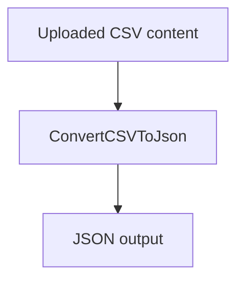
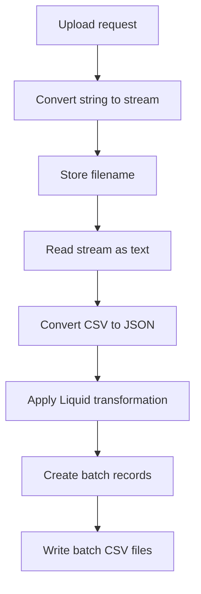

# UploadFileProcess documentation

`UploadFileProcess` is a Xenhey configuration-driven workflow for receiving file content, optionally converting or reading the input stream, converting CSV data to JSON, transforming records, and splitting the results into batch files for downstream processing.

In the current configuration, only `ConvertCSVToJson` is enabled. All other modules are disabled.

### 1. Process-level configuration

```json
{
  "Id": "UploadFileProcess",
  "LineOfBusinessProcessData": [
    {
      "Key": "object",
      "Type": "Xenhey.BPM.Core.Net8.Processes.ProcessData"
    }
  ],
  "Type": "",
  "DataFlowProcess": []
}
```

| Property                    | Value                                        | Explanation                                                                                      |
| --------------------------- | -------------------------------------------- | ------------------------------------------------------------------------------------------------ |
| `Id`                        | `UploadFileProcess`                          | Unique name used to identify and execute the workflow.                                           |
| `LineOfBusinessProcessData` | `object`                                     | Defines a shared process-data object available to workflow modules.                              |
| `ProcessData` type          | `Xenhey.BPM.Core.Net8.Processes.ProcessData` | Xenhey object used to carry the payload, metadata, filename, and intermediate results.           |
| `Type`                      | Empty                                        | No process-level implementation type is assigned. Processing is controlled by `DataFlowProcess`. |
| `DataFlowProcess`           | Array                                        | Ordered collection of workflow modules. Modules are evaluated in the order listed.               |

### 2. Module summary

|  # | Module key                            | Process type            | Enabled | Intended responsibility                                                        |
| -: | ------------------------------------- | ----------------------- | ------- | ------------------------------------------------------------------------------ |
|  1 | `ConvertStringToStream`               | `MessageBuilderProcess` | No      | Converts string content into a stream for stream-based processing.             |
|  2 | `StoreRequestInPayload`               | `MessageBuilderProcess` | No      | Stores selected request properties, such as `filename`, in the process object. |
|  3 | `ReadStreamToText`                    | `MessageBuilderProcess` | No      | Reads an input stream and converts it into plain text.                         |
|  4 | `ConvertCSVToJson`                    | `CSVProcess`            | **Yes** | Reads CSV text and converts the records into JSON.                             |
|  5 | `TransformRequestUsingLiquidTemplate` | `TransformationProcess` | No      | Applies a managed Liquid template to each JSON array record.                   |
|  6 | `CreateCSVBatchFilesForProcessing`    | `CSVProcess`            | No      | Creates batch metadata records, including Azure Table tracking records.        |
|  7 | `CreateCSVBatchFilesForProcessing`    | `CSVProcess`            | No      | Splits and writes CSV content into batch files in Blob Storage.                |

### Current active flow



If every module were enabled, the intended flow would resemble:



## Module 1: ConvertStringToStream

```json
{
  "Key": "ConvertStringToStream",
  "Type": "Xenhey.BPM.Core.Net8.Processes.MessageBuilderProcess",
  "Async": "false",
  "IsEnable": "false",
  "DataFlowProcessParameters": [
    {
      "Key": "ConvertStringToStream",
      "Value": "yes"
    }
  ]
}
```

| Property or parameter   | Value                   | Explanation                                                               |
| ----------------------- | ----------------------- | ------------------------------------------------------------------------- |
| `Type`                  | `MessageBuilderProcess` | Uses the Xenhey message-building and payload-conversion component.        |
| `Async`                 | `false`                 | The module completes before the next module starts.                       |
| `IsEnable`              | `false`                 | The module is currently skipped.                                          |
| `ConvertStringToStream` | `yes`                   | Instructs the module to convert the current string payload into a stream. |
| Expected input          | String                  | Uploaded file content represented as text.                                |
| Expected output         | Stream                  | A stream that can be consumed by later modules.                           |

Use this module when an endpoint receives file content as a string but a downstream component expects a stream.

## Module 2: StoreRequestInPayload

```json
{
  "Key": "StoreRequestInPayload",
  "Type": "Xenhey.BPM.Core.Net8.Processes.MessageBuilderProcess",
  "Async": "false",
  "IsEnable": "false",
  "DataFlowProcessParameters": [
    {
      "Key": "AddMessageToObject",
      "Value": "yes"
    },
    {
      "Key": "Filter",
      "Value": "[{\"Key\": \"payloadrequest\",\"Value\": \"filename\"}]"
    }
  ]
}
```

| Property or parameter | Value                       | Explanation                                                                            |
| --------------------- | --------------------------- | -------------------------------------------------------------------------------------- |
| `AddMessageToObject`  | `yes`                       | Adds selected values from the current request or message to the shared process object. |
| `Filter`              | `payloadrequest → filename` | Selects the `filename` property from `payloadrequest`.                                 |
| Expected input        | Request object              | Request containing a `payloadrequest.filename` property.                               |
| Expected output       | Updated process object      | Shared process data containing the filename or associated request metadata.            |
| Status                | Disabled                    | Filename extraction does not currently occur.                                          |

The `Filter` value is itself a JSON array stored as an escaped JSON string:

```json
[
  {
    "Key": "payloadrequest",
    "Value": "filename"
  }
]
```

A likely request structure is:

```json
{
  "payloadrequest": {
    "filename": "customers.csv"
  }
}
```

## Module 3: ReadStreamToText

```json
{
  "Key": "ReadStreamToText",
  "Type": "Xenhey.BPM.Core.Net8.Processes.MessageBuilderProcess",
  "Async": "false",
  "IsEnable": "false",
  "DataFlowProcessParameters": [
    {
      "Key": "ReadStreamToText",
      "Value": "yes"
    }
  ]
}
```

| Property or parameter | Value       | Explanation                                                                 |
| --------------------- | ----------- | --------------------------------------------------------------------------- |
| `ReadStreamToText`    | `yes`       | Reads the current stream and replaces or supplements the payload with text. |
| Expected input        | Stream      | Uploaded file stream.                                                       |
| Expected output       | String      | Plain-text contents of the uploaded file.                                   |
| Execution             | Synchronous | The text must be available before the next module executes.                 |
| Status                | Disabled    | No stream-to-text conversion currently occurs.                              |

This module would normally be enabled when the CSV converter expects plain-text CSV rather than a binary or file stream.

## Module 4: ConvertCSVToJson

```json
{
  "Key": "ConvertCSVToJson",
  "Type": "Xenhey.BPM.Core.Net8.Processes.CSVProcess",
  "Async": "false",
  "IsEnable": "true",
  "DataFlowProcessParameters": [
    {
      "Key": "ReadCSVAsPlainText",
      "Value": "yes"
    },
    {
      "Key": "messageformat",
      "Value": "application/json"
    }
  ]
}
```

| Property or parameter | Value              | Explanation                                        |
| --------------------- | ------------------ | -------------------------------------------------- |
| `Type`                | `CSVProcess`       | Uses the Xenhey CSV-processing module.             |
| `ReadCSVAsPlainText`  | `yes`              | Treats the incoming payload as CSV-formatted text. |
| `messageformat`       | `application/json` | Sets the resulting message format to JSON.         |
| Expected input        | CSV text           | CSV content, normally including a header row.      |
| Expected output       | JSON array         | One JSON object for each CSV data row.             |
| Status                | **Enabled**        | This is the only module currently executed.        |

Example input:

```csv
CustomerId,CustomerName,Region
1001,Contoso,East
1002,Fabrikam,Central
```

Expected conceptual output:

```json
[
  {
    "CustomerId": "1001",
    "CustomerName": "Contoso",
    "Region": "East"
  },
  {
    "CustomerId": "1002",
    "CustomerName": "Fabrikam",
    "Region": "Central"
  }
]
```

The exact data types depend on how `CSVProcess` performs type inference. Values may remain strings unless the module explicitly converts numbers, dates, or Boolean values.

## Module 5: TransformRequestUsingLiquidTemplate

```json
{
  "Key": "TransformRequestUsingLiquidTemplate",
  "Type": "Xenhey.BPM.Core.Net8.Processes.TransformationProcess",
  "Async": "false",
  "IsEnable": "false",
  "DataFlowProcessParameters": [
    {
      "Key": "TransformJSONPayloadArray",
      "Value": "yes"
    },
    {
      "Key": "ManagedTemplateName",
      "Value": "yes"
    },
    {
      "Key": "FileName",
      "Value": "data.liquid"
    },
    {
      "Key": "Container",
      "Value": "config"
    },
    {
      "Key": "StorageAccount",
      "Value": "AzureWebJobsStorage"
    }
  ]
}
```

| Property or parameter       | Value                   | Explanation                                                               |
| --------------------------- | ----------------------- | ------------------------------------------------------------------------- |
| `Type`                      | `TransformationProcess` | Uses the Xenhey data-transformation component.                            |
| `TransformJSONPayloadArray` | `yes`                   | Applies the transformation to a JSON array payload.                       |
| `ManagedTemplateName`       | `yes`                   | Indicates that the Liquid template is managed or retrieved by name.       |
| `FileName`                  | `data.liquid`           | Liquid template file to load.                                             |
| `Container`                 | `config`                | Blob container holding the template.                                      |
| `StorageAccount`            | `AzureWebJobsStorage`   | Application-setting name containing the storage connection configuration. |
| Expected input              | JSON array              | Output produced by `ConvertCSVToJson`.                                    |
| Expected output             | Transformed JSON        | JSON records mapped to the required downstream schema.                    |
| Status                      | Disabled                | No Liquid transformation currently occurs.                                |

The expected template location is conceptually:

```text
AzureWebJobsStorage
└── config
    └── data.liquid
```

Example Liquid template:

```liquid
{
  "customerId": "{{ CustomerId }}",
  "customerName": "{{ CustomerName }}",
  "region": "{{ Region }}",
  "source": "CSVUpload"
}
```

## Module 6: Create Azure Table batch records

```json
{
  "Key": "CreateCSVBatchFilesForProcessing",
  "Type": "Xenhey.BPM.Core.Net8.Processes.CSVProcess",
  "Async": "false",
  "IsEnable": "false",
  "DataFlowProcessParameters": [
    {
      "Key": "StorageAccount",
      "Value": "AzureWebJobsStorage"
    },
    {
      "Key": "CreateRecordForAzureTableBatch",
      "Value": "Yes"
    },
    {
      "Key": "BatchSize",
      "Value": "201"
    },
    {
      "Key": "FolderName",
      "Value": "CSVFiles"
    },
    {
      "Key": "TableName",
      "Value": "csvbatchfiles"
    },
    {
      "Key": "Container",
      "Value": "processed"
    },
    {
      "Key": "FileExtension",
      "Value": ".csv"
    },
    {
      "Key": "ContentType",
      "Value": "csv/text"
    }
  ]
}
```

| Property or parameter            | Value           | Explanation                                                                     |
| -------------------------------- | --------------- | ------------------------------------------------------------------------------- |
| `CreateRecordForAzureTableBatch` | `Yes`           | Creates tracking or processing records for generated CSV batches.               |
| `BatchSize`                      | `201`           | Configures the number of CSV records associated with each generated batch.      |
| `FolderName`                     | `CSVFiles`      | Logical folder used for generated batch files.                                  |
| `TableName`                      | `csvbatchfiles` | Azure Table used to track batch metadata or processing state.                   |
| `Container`                      | `processed`     | Blob container used for processed output.                                       |
| `FileExtension`                  | `.csv`          | File extension assigned to generated batch files.                               |
| `ContentType`                    | `csv/text`      | Content type assigned by the workflow. Consider whether `text/csv` is required. |
| Expected output                  | Table records   | One or more tracking records describing batch files.                            |
| Status                           | Disabled        | No batch tracking records are currently created.                                |

A conceptual tracking record might look like:

```json
{
  "PartitionKey": "UploadFileProcess",
  "RowKey": "batch-0001",
  "FileName": "CSVFiles/batch-0001.csv",
  "Container": "processed",
  "RecordCount": 201,
  "Status": "Pending"
}
```

## Module 7: Write CSV batch files to storage

```json
{
  "Key": "CreateCSVBatchFilesForProcessing",
  "Type": "Xenhey.BPM.Core.Net8.Processes.CSVProcess",
  "Async": "false",
  "IsEnable": "false",
  "DataFlowProcessParameters": [
    {
      "Key": "StorageAccount",
      "Value": "AzureWebJobsStorage"
    },
    {
      "Key": "WriteCsvToStorageAsBatch",
      "Value": "Yes"
    },
    {
      "Key": "BatchSize",
      "Value": "201"
    },
    {
      "Key": "FolderName",
      "Value": "CSVFiles"
    },
    {
      "Key": "TableName",
      "Value": "csvbatchfiles"
    },
    {
      "Key": "Container",
      "Value": "processed"
    },
    {
      "Key": "FileExtension",
      "Value": ".csv"
    },
    {
      "Key": "ContentType",
      "Value": "csv/text"
    }
  ]
}
```

| Property or parameter      | Value                      | Explanation                                                                |
| -------------------------- | -------------------------- | -------------------------------------------------------------------------- |
| `WriteCsvToStorageAsBatch` | `Yes`                      | Splits the CSV data and writes each group as a separate Blob Storage file. |
| `BatchSize`                | `201`                      | Maximum configured number of CSV records per output file.                  |
| `FolderName`               | `CSVFiles`                 | Blob virtual directory for the output files.                               |
| `Container`                | `processed`                | Destination Blob Storage container.                                        |
| `TableName`                | `csvbatchfiles`            | Tracking table that may be updated after the files are written.            |
| `FileExtension`            | `.csv`                     | Output file extension.                                                     |
| `ContentType`              | `csv/text`                 | Blob content type. The conventional MIME type is `text/csv`.               |
| Expected input             | CSV or transformed records | Dataset to split into smaller batches.                                     |
| Expected output            | Multiple CSV blobs         | Batch files stored under `processed/CSVFiles`.                             |
| Status                     | Disabled                   | No files are currently written.                                            |

Conceptual storage structure:

```text
processed
└── CSVFiles
    ├── batch-0001.csv
    ├── batch-0002.csv
    └── batch-0003.csv
```

## Configuration observations

| Observation                            | Impact                                                                                                        | Recommendation                                                                               |
| -------------------------------------- | ------------------------------------------------------------------------------------------------------------- | -------------------------------------------------------------------------------------------- |
| Only `ConvertCSVToJson` is enabled     | The process stops after producing JSON.                                                                       | Enable additional modules according to the required workflow.                                |
| Modules 6 and 7 use the same `Key`     | Logging, lookup, diagnostics, or module-specific configuration may be ambiguous.                              | Assign unique keys such as `CreateAzureTableBatchRecords` and `WriteCSVBatchFilesToStorage`. |
| `BatchSize` is `201`                   | If this represents an Azure Table transactional batch, it exceeds Azure Table’s 100-entity transaction limit. | Confirm whether it refers to CSV rows per file or Azure Table transaction size.              |
| `ContentType` is `text/csv`            | This is the conventional CSV MIME type.                                                                   | Use `text/csv` unless Xenhey specifically requires `csv/text`.                               |
| Boolean settings are strings           | The runtime must parse `"true"`, `"false"`, `"yes"`, and `"Yes"` consistently.                                | Standardize casing and values if supported.                                                  |
| Root `Type` is empty                   | May be intentional for configuration-driven execution.                                                        | Confirm that no process-level type is required.                                              |
| Stream conversion modules are disabled | The enabled CSV module must receive plain CSV text directly.                                                  | Enable stream conversion only when the upload endpoint returns a stream or encoded content.  |

A clearer naming pattern for the final modules would be:

```json
{
  "Key": "CreateAzureTableBatchRecords",
  "Type": "Xenhey.BPM.Core.Net8.Processes.CSVProcess"
}
```

```json
{
  "Key": "WriteCSVBatchFilesToStorage",
  "Type": "Xenhey.BPM.Core.Net8.Processes.CSVProcess"
}
```
